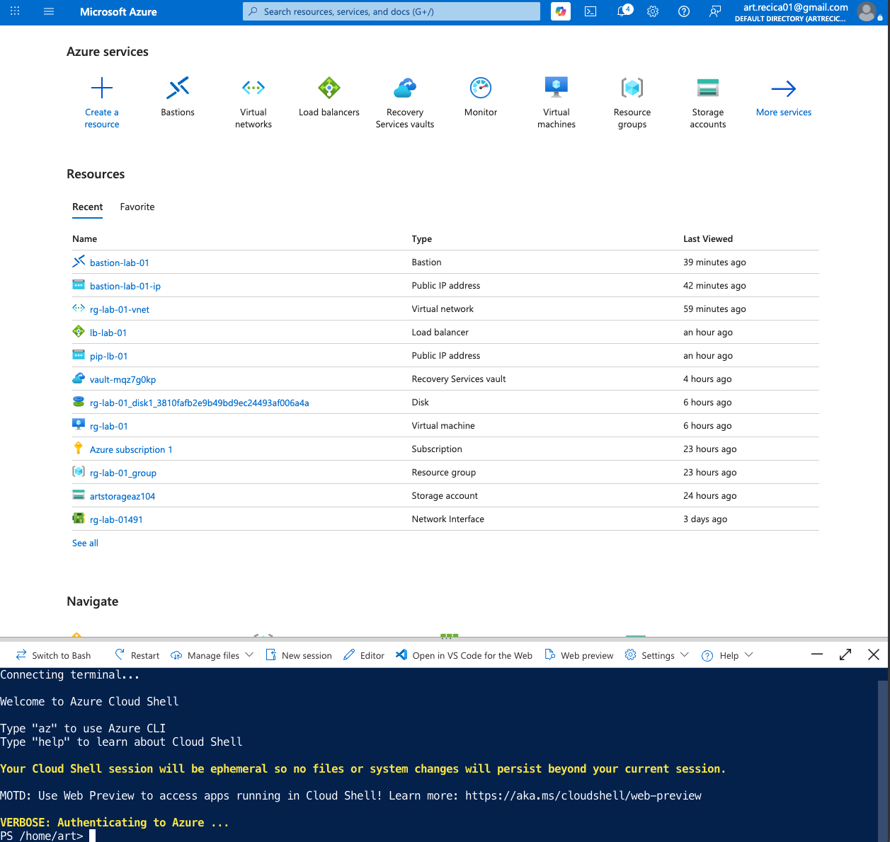
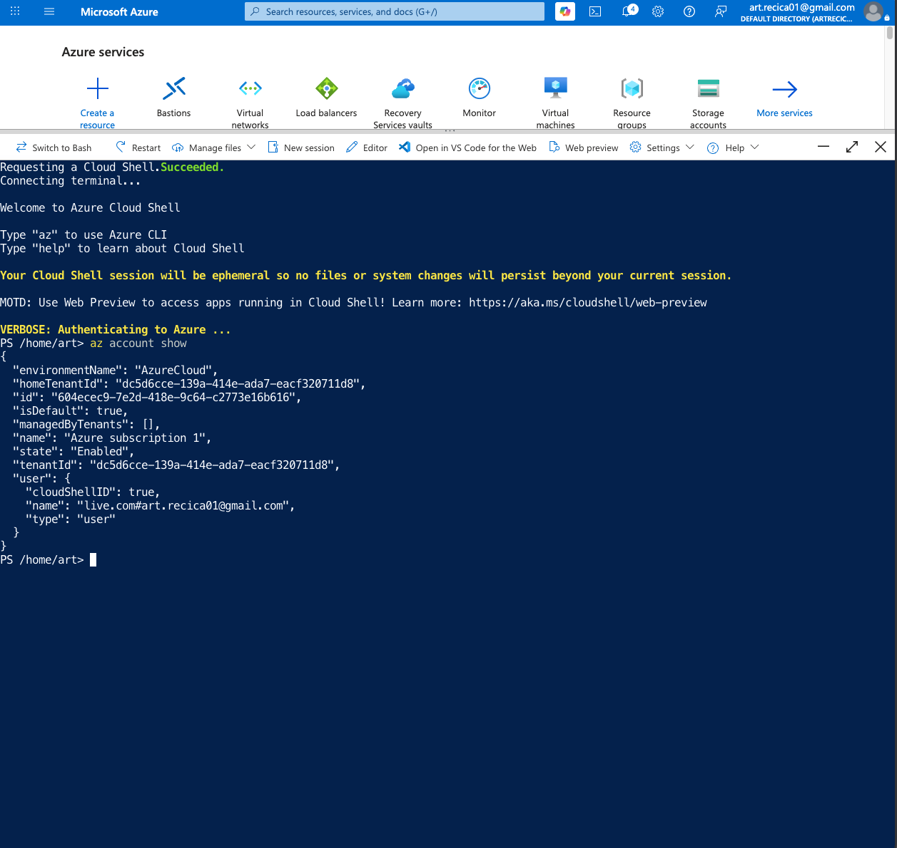
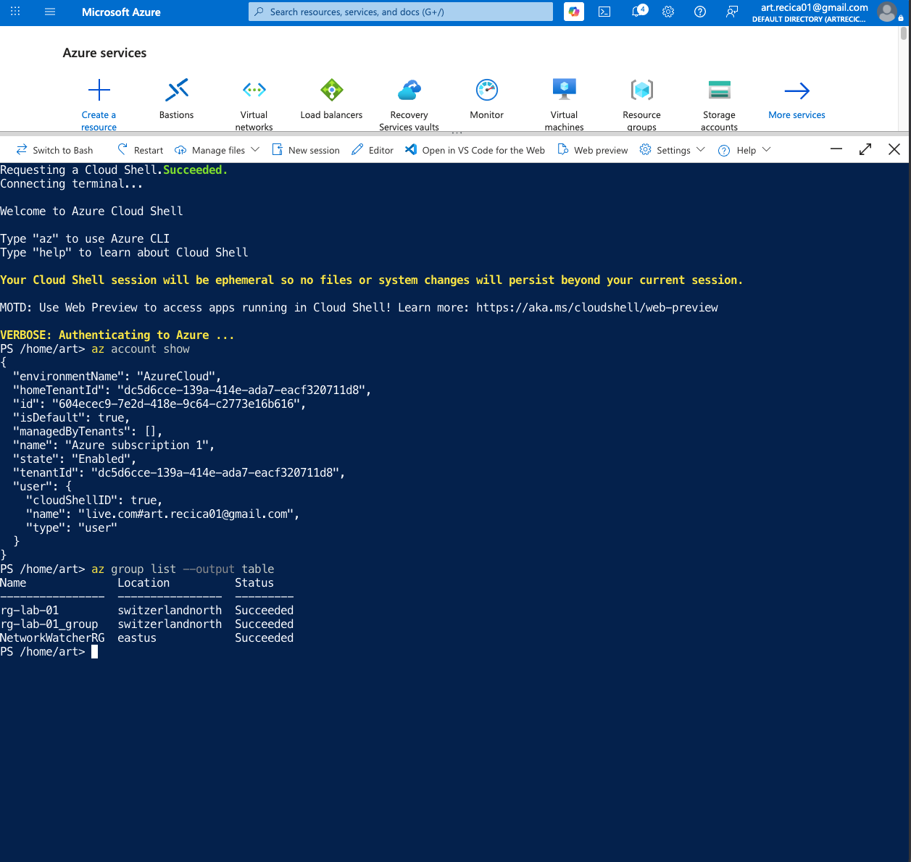
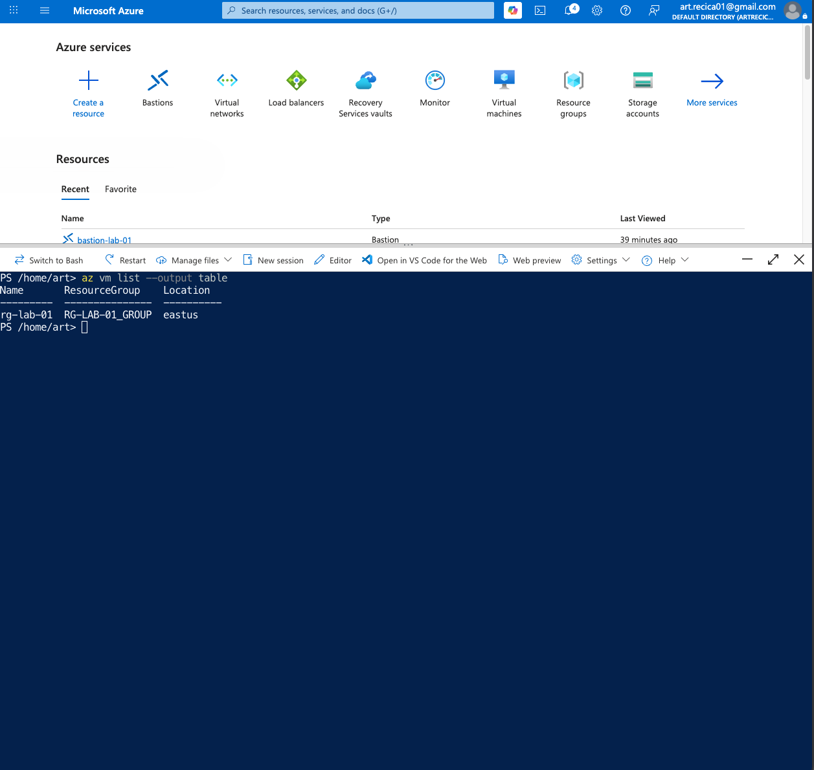
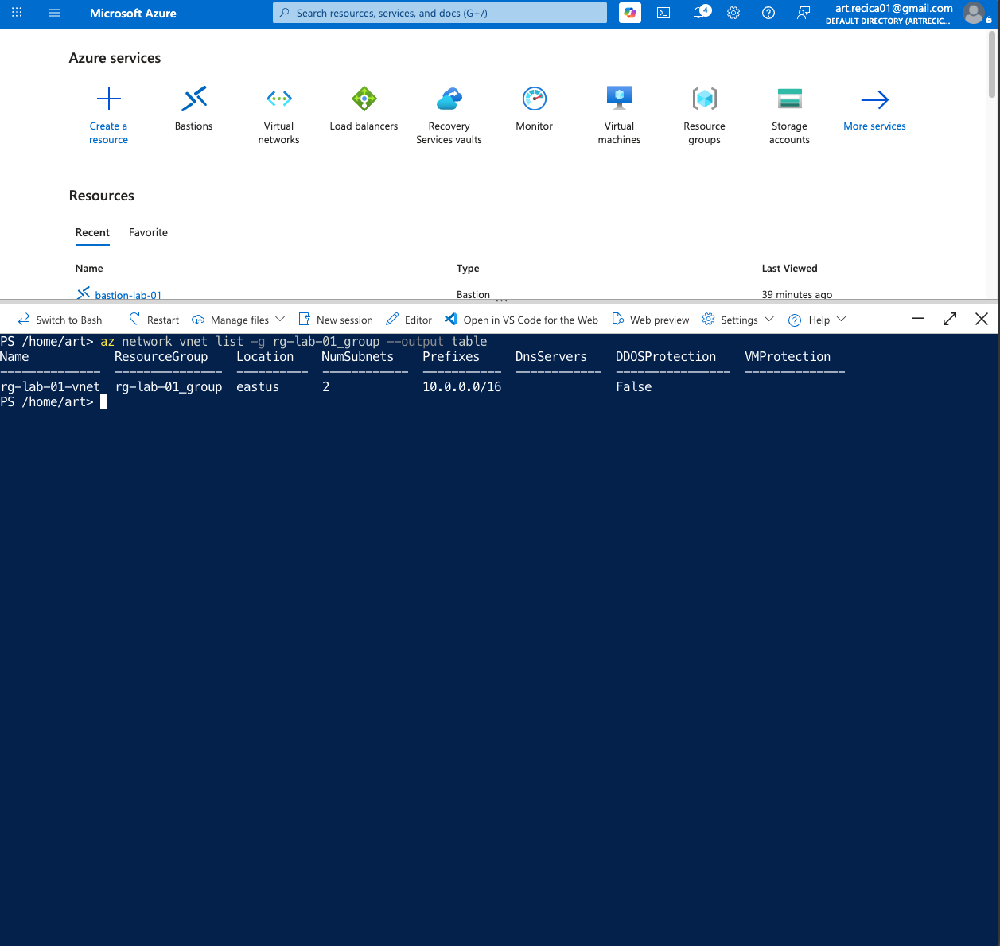
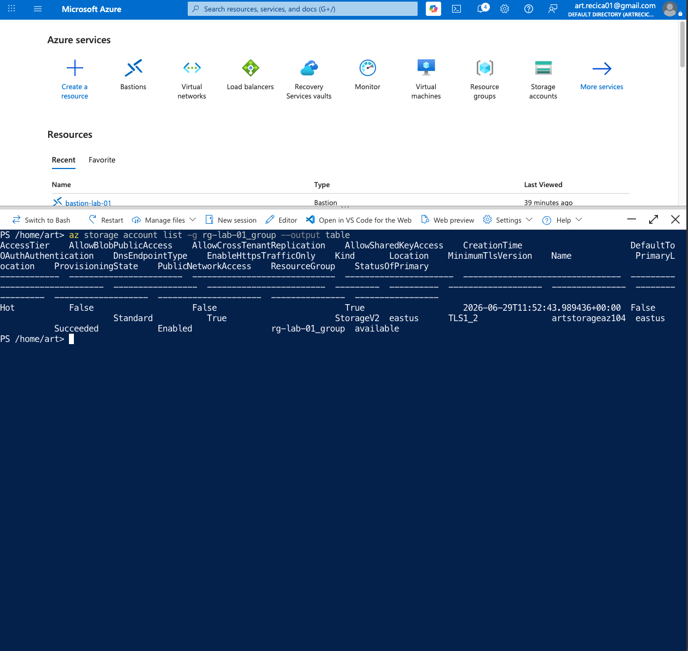
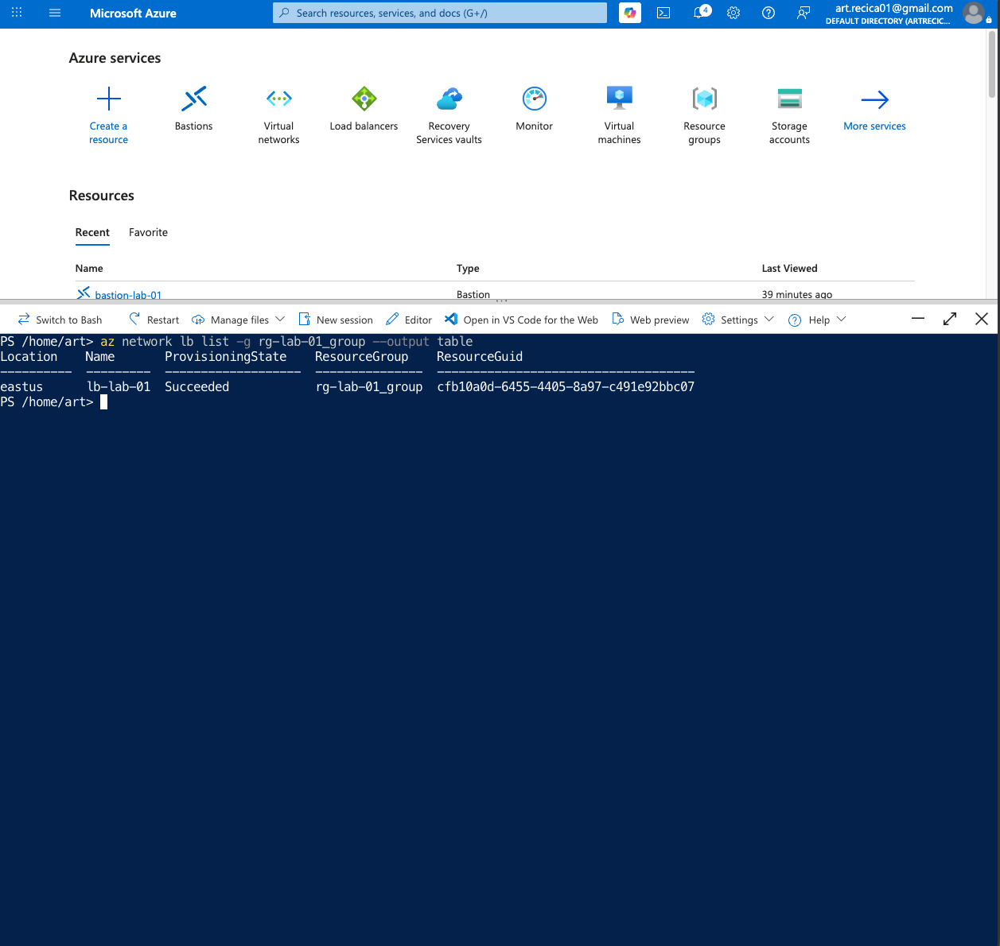
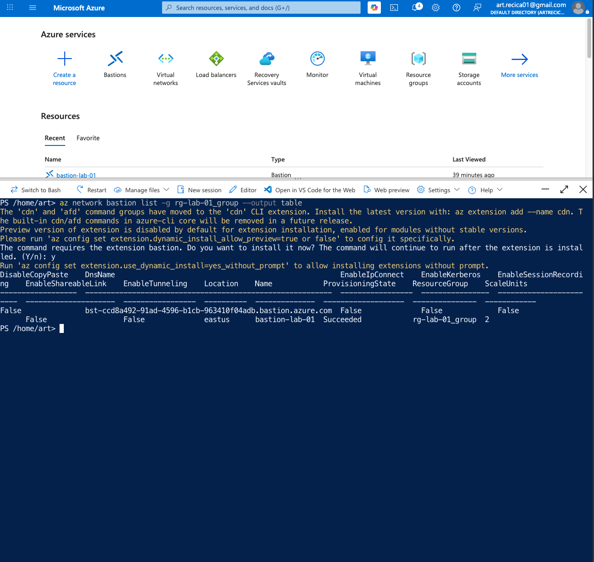
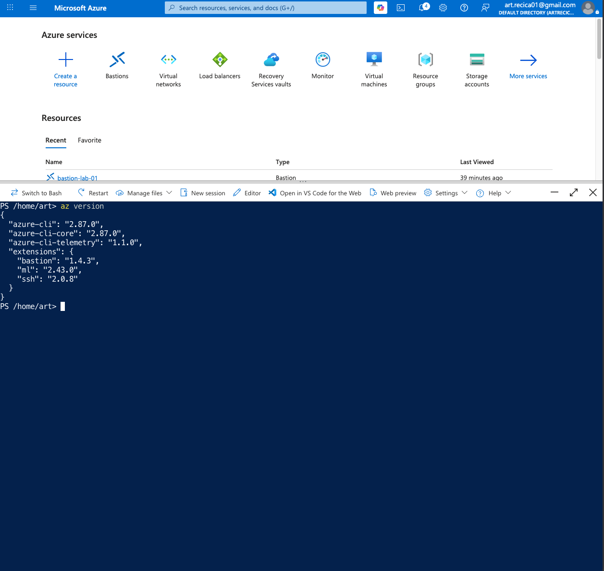

# Lab 10 – Azure CLI

## Objective

The goal of this lab was to become familiar with the Azure Command-Line Interface (Azure CLI) and learn how to manage Azure resources directly from the terminal instead of using only the Azure Portal.

## Technologies Used

- Microsoft Azure
- Azure Cloud Shell
- Azure CLI
- Virtual Network
- Virtual Machine
- Azure Bastion
- Azure Load Balancer
- Azure Storage Account

---

## Screenshots

### 01 - Azure Cloud Shell

Opened Azure Cloud Shell and prepared the Azure CLI environment.

---

### 02 - Azure Account Information

Displayed information about the active Azure subscription.

---

### 03 - Resource Groups

Listed all available Azure Resource Groups.

---

### 04 - Virtual Machines

Displayed all Virtual Machines using Azure CLI.

---

### 05 - Virtual Networks

Listed all Virtual Networks inside the Resource Group.

---

### 06 - Storage Accounts

Displayed all Azure Storage Accounts.

---

### 07 - Load Balancer

Listed Azure Load Balancers.

---

### 08 - Azure Bastion

Displayed Azure Bastion resources using Azure CLI.

---

### 09 - Azure CLI Version

Displayed the installed Azure CLI version.

---

## Result

This lab demonstrated how Azure resources can be queried and managed using Azure CLI. It provided practical experience with common administrative commands that are frequently used by Azure administrators.
